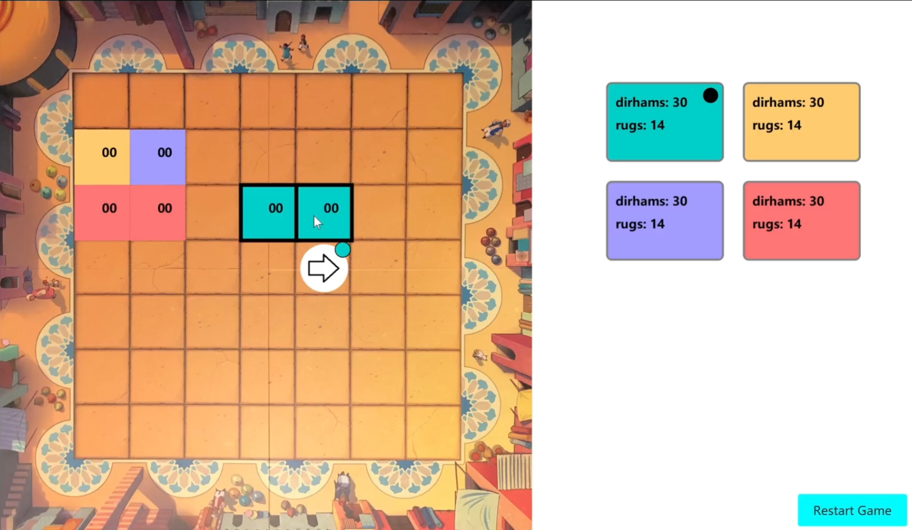

# README - Marrakech Game

## Overview of the Game

Marrakech is a strategic board game where players compete as merchants in the Marrakech market. The objective is to manage rugs and dirhams (currency) effectively to gain the most visible area on the board and the highest amount of money. Players take turns manipulating the movement of Assam, the market owner, across a 7x7 board by rolling dice, strategically placing rugs, and potentially paying other players if Assam lands on their rugs.



## Implementation with JavaFX

The game is implemented using JavaFX, providing a graphical user interface (GUI) that displays the board, Assam, rugs, and player stats. The GUI allows for interactive gameplay through mouse and keyboard inputs to control Assam's movement, place rugs, and navigate through the game phases.

## Running the Game Locally

To download and run the game locally on your computer, follow these steps:

1. **Clone the Repository**:

   - Open your terminal.

   - Clone the repository using Git:

     ```
     git clone https://github.com/yourusername/2023-javafx-MarrakechGame.git
     ```

   - Navigate to the cloned directory:

     ```
     cd 2023-javafx-MarrakechGame
     ```

2. **Compile and Run**:

   - Ensure Java and JavaFX are installed on your computer.

   - Compile the Java files. If JavaFX is set up correctly on your IDE like IntelliJ or Eclipse, you can directly run the main class. Alternatively, use the following command line (adjust paths to your JavaFX lib  directory):

     ```
     javac --module-path path/to/javafx-sdk/lib --add-modules javafx.controls,javafx.fxml -d out src/*.java
     ```

   - Run the program:

     ```
     java --module-path path/to/javafx-sdk/lib --add-modules javafx.controls,javafx.fxml -cp out Main
     ```

Enjoy playing Marrakech directly on your computer through a user-friendly JavaFX interface!
